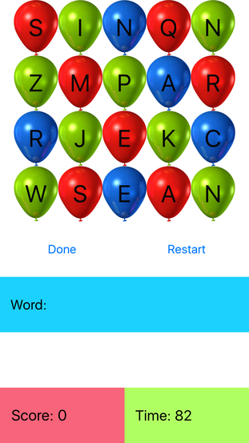

# Letter Pop
Letter Pop is an iOS word game that aims to allow young children to learn vocabulary in a fun and easy manner.  On the screen, there are letters on balloons and you pop the balloons to spell out words; each word is checked by a full English dictionary to validate whether the word spelled is an actual word.

Developed on Android in 2014-15 (version now obsolete). Developed on iOS in 2015-16. 

